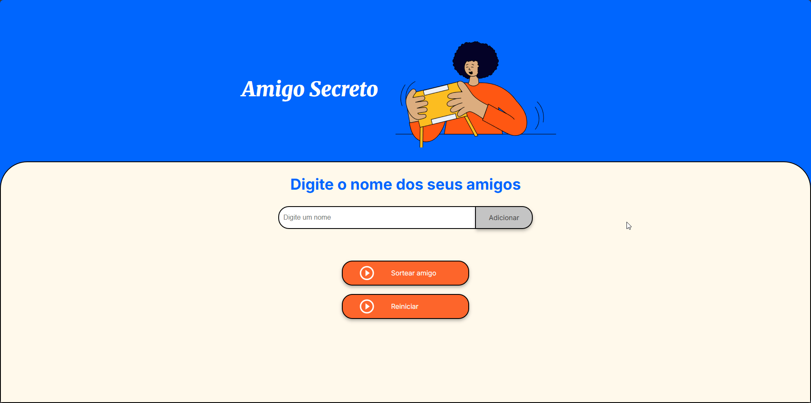

# Sorteador de Amigo Secreto


Este projeto é o resultado do desafio "Amigo Secreto" do programa **Oracle Next Education (ONE)** em parceria com a **Alura**. Trata-se de uma aplicação web simples e funcional para realizar sorteios, desenvolvida com HTML, CSS e JavaScript puros.



---

## Funcionalidades

O projeto conta com as seguintes funcionalidades:

* **Adicionar Amigos:** Inclua participantes na lista de sorteio de forma rápida.
* **Validação de Nomes:** O sistema impede que nomes vazios ou duplicados sejam adicionados, garantindo a integridade da lista.
* **Excluir Amigos:** Remova nomes individualmente da lista a qualquer momento com um botão de exclusão ao lado de cada nome.
* **Sorteio Simples:** Com um clique, o sistema sorteia aleatoriamente um nome da lista de participantes.
* **Reiniciar Jogo:** Limpe a lista de nomes e o resultado do sorteio para começar uma nova rodada com facilidade.
* **Design Responsivo:** A interface se adapta a diferentes tamanhos de tela, funcionando bem em desktops e dispositivos móveis.

---

## Tecnologias Utilizadas

* **HTML5:** Para a estrutura semântica da página.
* **CSS3:** Para a estilização, utilizando Flexbox para um layout moderno e variáveis CSS para um tema consistente.
* **JavaScript:** Para toda a lógica de manipulação do DOM, incluindo adicionar, remover, sortear e reiniciar.

---

## Como Usar

Para executar o projeto localmente, siga os passos abaixo:

1.  **Clone o repositório:**
    ```bash
    git clone [https://github.com/Hossomii/challenge-amigo-secreto_pt-main.git](https://github.com/Hossomii/challenge-amigo-secreto_pt-main.git)
    ```
2.  **Navegue até o diretório do projeto:**
    ```bash
    cd challenge-amigo-secreto_pt-main
    ```
3.  **Abra o arquivo `index.html`** no seu navegador de preferência.

Pronto! Agora você pode adicionar os nomes dos seus amigos e realizar o sorteio.

---

## Autor

Desenvolvido por **Anthony S. Bugs (Hossomii)**.

[](https://github.com/Hossomii)